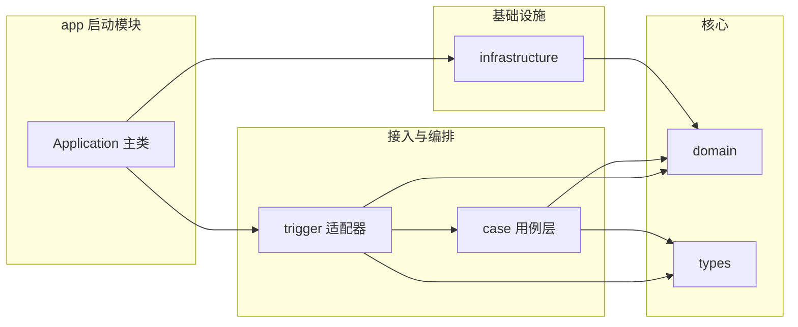

# Pets_AI 后端 DDD 重构说明

本文档基于参考工程 **ai-mcp-gateway**（小傅哥 xfg-frame-archetype 系 DDD 脚手架）的分层范式，对照阿里 **COLA** 及业界常见「多模块 + 分层」实践，评估当前 **Pets_AI** 后端现状，并给出可渐进落地的重构方向。目标不是为分层而分层，而是提升**可维护性、可测试性与限界上下文清晰度**。

**文档落盘路径**：`backend/docs/DDD_REFACTORING.md`（与计划一致）。

---

## 1. 背景与目标

### 1.1 背景

- 参考工程 `ai-mcp-gateway` 采用多 Maven 模块与 trigger / case / domain / infrastructure 分离，提供了可借鉴的工程骨架。
- Pets_AI 后端当前为**单模块**，但已按 **identity、conversation、pet、ai、storage、shared** 等包划分限界上下文，并具备 domain / application / infrastructure / interfaces 四层雏形。
- 「大厂」实践（如 COLA、各厂内部模板）普遍强调：**依赖方向可验证、领域层尽量少依赖框架、接入层与用例编排分离、契约（API）与运行时（Web/Reactive）解耦**。

### 1.2 目标

| 目标 | 说明 |
|------|------|
| 统一语言 | 团队对「适配器 / 应用服务 / 领域 / 基础设施」职责有一致理解 |
| 可演进架构 | 支持从单模块 + 包规则，渐进演进到多模块，而不必一次性大改 |
| 吸收参考工程优点 | 多模块边界、types 共享、trigger 作为接入层等 |
| 规避参考工程短板 | 领域层框架侵入、API 契约绑定 Spring WebFlux 类型、聚合未落地等 |

---

## 2. 参考工程 ai-mcp-gateway 架构解析

参考工程 README 指向小傅哥 DDD 教程；工程本身为 **Maven 多模块**，模块职责如下。

| 模块 | 职责 | 说明 |
|------|------|------|
| `ai-mcp-gateway-api` | 对外服务契约 | 定义如 `IMcpGatewayService` 等接口 |
| `ai-mcp-gateway-trigger` | 接入层（Adapter） | HTTP Controller 等，实现 `api` 中接口 |
| `ai-mcp-gateway-case` | 用例编排 | 依赖 `xfg-wrench` 策略树，处理会话、消息等流程节点 |
| `ai-mcp-gateway-domain` | 领域层 | 实体、值对象、仓储接口、领域服务 |
| `ai-mcp-gateway-infrastructure` | 基础设施 | 仓储实现、MyBatis Mapper、PO |
| `ai-mcp-gateway-types` | 跨模块类型 | 枚举、通用异常等 |
| `ai-mcp-gateway-app` | 启动与组装 | 依赖 `trigger`、`infrastructure`，承载 Spring Boot 入口 |

### 2.1 模块依赖关系（逻辑）



典型请求路径可概括为：**HTTP → trigger（Controller）→ case（策略树 / 应用编排）→ domain（领域服务、仓储接口）← infrastructure（仓储实现）**。

### 2.2 与 COLA 命名的对应关系

| 参考工程 | COLA 常见命名 | 职责 |
|----------|----------------|------|
| `trigger` | `adapter`（Web 适配器） | 协议转换、参数绑定、调用用例 |
| `case` | `app`（应用层） | 用例编排、事务边界（常与应用服务对应） |
| `domain` | `domain` | 领域模型与领域逻辑 |
| `infrastructure` | `infrastructure` | 持久化、外部系统实现 |
| `api` | `client` / 契约模块 | 对外暴露的接口定义（实现细节各异） |

**建议**：对内代码可保留 `case` 等历史命名，但在架构文档与新人 onboarding 中**统一称为「应用服务层 / 用例层」**，避免与「领域服务（Domain Service）」混淆。

---

## 3. 与 COLA / 大厂常见实践的差异与改进点

以下针对参考工程与 COLA 所强调的约束逐条对照；**不代表参考工程无价值**，而是明确向腾讯、阿里等团队常见工程化标准靠拢时的**增强点**。

### 3.1 领域层纯净度（依赖倒置）

- **COLA 期望**：`domain` 尽量不依赖 Spring、Servlet、WebFlux、Reactor 等，便于纯单元测试与复用。
- **参考工程现状**：`ai-mcp-gateway-domain` 的 POM 中声明了 `spring-boot-starter-web`、`reactor-core` 等，**领域层被框架污染**，测试时常需带 Spring 或额外桩，成本偏高。
- **改进方向**：领域层仅保留 Java 标准库 + 极少数无框架的第三方；Web/Reactive 类型留在 `trigger` 或独立 `adapter` 模块，在边界处转换。

### 3.2 API 契约中立性

- **参考工程**：`IMcpGatewayService` 使用 `Flux`、`Mono`、`ResponseEntity` 等 **Spring WebFlux / Spring Web** 类型，契约与具体运行时强绑定。
- **风险**：若后续需要 Dubbo、gRPC 或独立 Java Client，往往要**重写契约**或引入适配层。
- **改进方向**：`api` 模块优先使用**中立 DTO + 同步/异步语义由文档或单独 adapter 扩展**；或拆为「纯契约模块」与「Spring 实现模块」。响应式流在适配器内再包装为 `Flux`/`Mono`。

### 3.3 聚合与一致性边界

- **参考工程**：`aggregate` 包下多为 `package-info` 说明，**缺少真实 Aggregate Root、不变式与仓储操作粒度的一致性设计**，容易沦为「目录模板化」。
- **大厂落地**：更强调**聚合边界 = 事务与一致性边界**，仓储接口方法以聚合为粒度设计，避免「贫血模型 + 到处 CommandEntity」替代聚合设计。

### 3.4 命名空间：实体 vs 应用命令 vs 领域命令对象

- **参考工程**：大量 `*CommandEntity` 放在 `domain.model.entity` 下，易与**应用层 Command**、**领域实体**混淆。
- **改进方向**：
  - **领域实体 / 值对象**：表达业务概念与不变式；
  - **应用命令**：放在 `application.command`（或 `app` 层），表示用例输入；
  - 若必须保留「领域服务入参对象」，可用 `*Spec`、`*Criteria` 等命名，避免 `Entity` 与 JPA 实体、聚合实体三重语义重叠。

### 3.5 仓储契约与实现一致

- **反例**：部分仓储实现存在**未实现逻辑（如直接 `return null`）**，领域接口与实现不一致，会在运行时才暴露问题。
- **改进方向**：契约方法要么实现，要么删除或标记为未支持并集中处理；关键路径配套单测或契约测试。

---

## 4. 参考工程不足与风险清单（客观）

| 类别 | 说明 |
|------|------|
| 框架侵入领域 | domain 依赖 Spring Web / Reactor，削弱「纯领域」优势 |
| API 绑定运行时类型 | 契约模块难以复用到非 WebFlux 场景 |
| 聚合未落地 | aggregate 包缺少真实聚合根与边界实践 |
| 命名混淆 | `*CommandEntity` 与分层职责边界不清 |
| 实现完整性 | 部分仓储方法空实现或恒为 null，技术债 |
| 工程卫生（次要） | 如包路径拼写错误（`managerment`）、`javax.annotation.Resource` 与 Spring Boot 3 的 Jakarta 命名空间、`case` 模块 `finalName` 与 artifact 不一致等，反映「分层正确≠细节无欠账」 |

---

## 5. Pets_AI 后端现状评估

### 5.1 结构与模块形态

- **单模块 Maven**（`backend/pom.xml`），通过**包名**划分限界上下文：`identity`、`conversation`、`pet`、`ai`、`storage`、`shared`。
- 各上下文内常见分层：`domain`、`application`、`infrastructure`、`interfaces`，**已具备经典四层雏形**，与 COLA 思想兼容。

### 5.2 相对参考工程的优势

- **应用层**：如 `MessageApplicationService` 使用 `SendMessageCommand`、DTO、仓储与 `ChatDomainService` 等协作，**更接近 COLA 中「应用服务编排用例」**，而非仅依赖 `*CommandEntity` 贯穿各层。
- **领域模型**：`ChatSession`、`Message`、`User` 等包含**行为方法**（如 `validateOwnership`、`updateTitle`），比「大量 CommandEntity + 过程式领域服务」更符合充血模型方向。
- **横切能力**：如统一响应、异常处理、OpenAPI 等集中在 `shared.infrastructure`，边界相对清晰。

### 5.3 待澄清与风险点

| 点 | 说明 |
|----|------|
| `ai` 与 `conversation` | 模型路由、Spring AI 封装与对话上下文的边界需文档化，避免双向依赖 |
| `shared` 与 Shared Kernel | 区分「真正共享内核」与「仅为便利的工具包」，防止 shared 膨胀成大泥球 |
| 单模块依赖约束 | 缺少 **ArchUnit** 或包规则时，`domain` 引用 `infrastructure` 等错误依赖难以在编译期拦截 |

---

## 6. 目标架构原则（渐进式）

不强制一次性拆 Maven 模块；提供两阶段路径，按团队节奏选择。

### 6.1 阶段 A：单模块强化（低成本）

- 文档化各**限界上下文**职责与依赖规则（只允许：interfaces → application → domain；infrastructure 实现 domain 接口）。
- 引入 **ArchUnit**（或团队等价工具）测试：`domain` 不依赖 `infrastructure`、`interfaces` 等。
- 统一术语：Controller 仅做协议适配，复杂流程进 `application`；领域规则留在实体与领域服务。

### 6.2 阶段 B：多模块拆分（与参考工程对齐并可纠偏）

可选 Maven 结构示例（命名可对齐 COLA，也可保留语义化模块名）：

| 建议模块 | 职责 | 与 ai-mcp-gateway 对应 |
|----------|------|-------------------------|
| `pets-ai-types` 或 `pets-ai-common` | 跨上下文枚举、错误码、无业务语义的共享类型 | `types` |
| `pets-ai-domain-identity` 等 **或** 单 `pets-ai-domain` 分包 | 各领域仓储接口、实体、领域服务 | `domain` |
| `pets-ai-application` | 应用服务、Command/DTO、编排 | `case` |
| `pets-ai-adapter-web` | REST、Security、OpenAPI 适配 | `trigger` |
| `pets-ai-infrastructure` | JPA、OSS、Redis 等实现 | `infrastructure` |
| `pets-ai-bootstrap` / `pets-ai-app` | Spring Boot 启动与配置 | `app` |

**纠偏要点**：拆模块时即落实 **domain 不依赖 Spring Web**，契约模块避免绑定 `Flux`/`Mono`（除非团队明确仅 REST WebFlux）。

### 6.3 模块依赖矩阵（目标方向）

|  | types | domain | application | adapter | infrastructure | app |
|--|-------|--------|-------------|---------|----------------|-----|
| types | — | 可被依赖 | 可 | 可 | 可 | 可 |
| domain | 可 | — | 可 | 否（仅接口） | 否 | 否 |
| application | 可 | 可 | — | 否 | 否 | 否 |
| adapter | 可 | 接口 | 可 | — | 否 | 否 |
| infrastructure | 可 | 实现 | 否 | 否 | — | 否 |
| app | 可 | 间接 | 间接 | 可 | 可 | — |

（具体是否拆分 `domain` 为多模块取决于团队规模与发布粒度，小团队可维持单 `domain`  jar 内分包。）

---

## 7. 迁移步骤与优先级建议

1. **冻结新债**：新增代码遵守分层与命名约定；禁止在 `domain` 中引入 Web/OSS 等框架类型。
2. **补充测试与规则**：为核心用例补测试；引入 ArchUnit 守护包依赖。
3. **梳理上下文**：书面定义 `ai` vs `conversation`、`shared` 边界，必要时抽 Anti-Corruption Layer（防腐层）对接 Spring AI / 外部 API。
4. **再拆 Maven 模块**：在依赖规则稳定后，按阶段 B 拆分，减少大规模合并冲突。
5. **契约与 API**：若未来多客户端或 RPC，再抽独立 `client`/OpenAPI 生成模块；当前单后端可保持 SpringDoc 与 `OpenApiConfig` 位于 **adapter 或 shared 基础设施**，与 COLA 中「适配器 + 插件化扩展」思路一致。

---

## 8. 附录

### 8.1 术语表

| 术语 | 含义 |
|------|------|
| 限界上下文 | 业务边界清晰的子域，对应一组统一模型与语言 |
| 应用服务 | 编排用例、事务边界，不承载核心业务规则 |
| 领域服务 | 跨多个实体且不宜放在单一实体上的领域逻辑 |
| 防腐层 | 隔离外部模型与内部领域模型，防止外部概念污染核心域 |
| 适配器 | 将外部协议（HTTP 等）转为应用层调用 |

### 8.2 横切能力归属（示例）

| 能力 | 建议归属 |
|------|----------|
| OpenAPI / Swagger 配置 | Web 适配器模块或 `shared` 下 `infrastructure.openapi`（与现 `OpenApiConfig` 类似），避免业务 domain 依赖 |
| 全局异常、统一响应体 | `adapter` 或 `shared.infrastructure.web` |
| JWT 过滤器、Security | `identity` 适配器或 `shared` 安全子包，注意与领域「用户」概念边界 |

### 8.3 参考阅读

- 小傅哥 DDD 工程与教程（参考工程 README 中的 bugstack 链接）。
- 阿里 COLA 架构：Client / Adapter / App / Domain / Infrastructure 分层与扩展点思想（具体以官方文档为准）。

---

## 9. 实施记录（阶段 A）

已落地项与 [迁移步骤](#7-迁移步骤与优先级建议) 第 1～3 步对齐：

| 项 | 说明 |
|----|------|
| ArchUnit 分层守护 | 测试类 [`LayerDependencyRulesTest`](../src/test/java/jiangxiaopeng/ai/architecture/LayerDependencyRulesTest.java)：`..domain..` 不依赖 `..infrastructure..` / `..interfaces..`；`..application..` 不依赖 `..infrastructure..`。随 `mvn test` 执行。 |
| 限界上下文说明 | 见 [BOUNDED_CONTEXTS.md](./BOUNDED_CONTEXTS.md)（`ai` / `conversation` / `shared` 边界与跨上下文集成方式）。 |
| 依赖 | `pom.xml` 中 `archunit-junit5`（`${archunit.version}`）。 |

**后续（阶段 B 及以后）**：在分层规则稳定后，再按第 6.2 节拆 Maven 子模块；未动业务包结构，避免与进行中的功能开发大规模冲突。

### 9.2 阶段 B：Maven 多模块（已落地）

聚合工程 **`pets-ai-backend`**（[`backend/pom.xml`](../pom.xml)）子模块与职责：

| 模块 | ArtifactId | 职责 |
|------|------------|------|
| 共享类型 | `pets-ai-types` | `shared.exception`、`shared.domain`（含与 JPA/`HttpStatus` 的现有耦合） |
| 领域层 | `pets-ai-domain` | 各上下文 `domain` 包 |
| 应用层 | `pets-ai-application` | 各上下文 `application` 与 `shared.application` |
| 基础设施 | `pets-ai-infrastructure` | 各上下文 `infrastructure` 与 `shared.infrastructure` |
| Web 适配器 | `pets-ai-adapter-web` | 各上下文 `interfaces`（REST） |
| 启动 | `pets-ai-app` | `AiChatApplication`、资源配置、测试与 ArchUnit |

**构建与运行**（在 `backend/` 目录）：

```bash
# 在 backend/ 下先安装各模块到本地仓库，再启动（仅 -pl pets-ai-app 会因找不到兄弟模块而失败）
mvn clean install -DskipTests
cd pets-ai-app && mvn spring-boot:run

# 或打可执行包后运行
mvn clean package -DskipTests
java -jar pets-ai-app/target/pets-ai-app-1.0-SNAPSHOT.jar
```

**依赖倒置补充**：引入 `AccessTokenParser`（`identity.domain`）与 `ParsedAccessToken`，`JwtAuthenticationFilter` 仅依赖领域接口，`JwtTokenService` 在应用层实现，避免 **infrastructure → application** 的编译期耦合。

---

## 文档修订记录

| 版本 | 日期 | 说明 |
|------|------|------|
| 1.0 | 2026-04-08 | 初版：对照 ai-mcp-gateway 与 Pets_AI 现状，给出渐进式重构方向 |
| 1.1 | 2026-04-08 | 增加 §9 阶段 A 实施记录；关联 BOUNDED_CONTEXTS 与 ArchUnit |
| 1.2 | 2026-04-08 | §9.2 阶段 B 多模块与构建说明；AccessTokenParser 倒置 |
